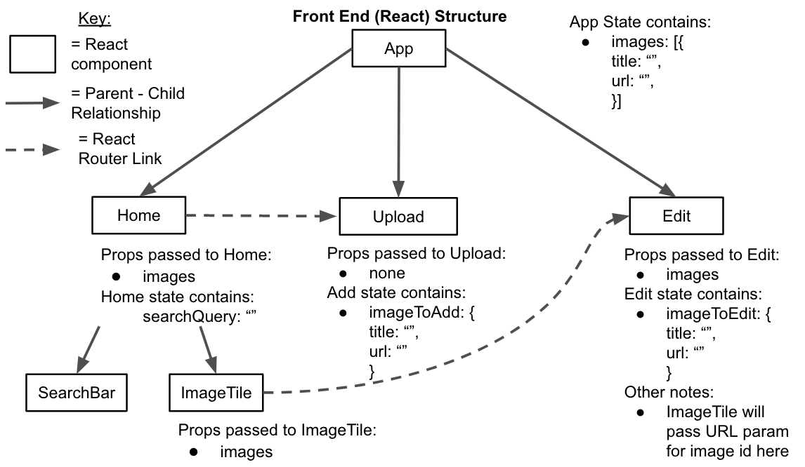
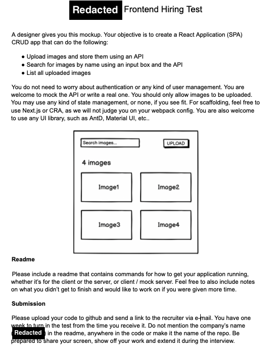
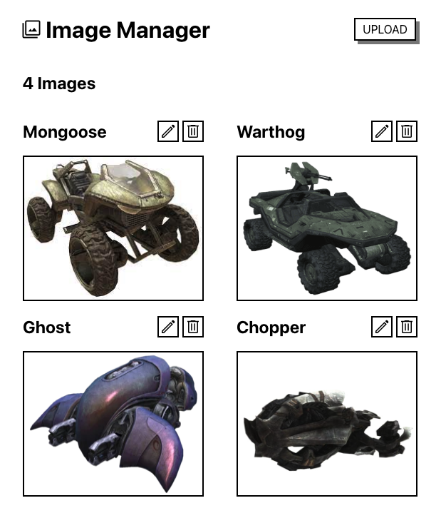

# Image Manager App
This project is an interview assignment by Phil Garbrecht for an unnamed company. The front end allows users to upload images which are then stored in the imgBB api. Each image is sent as a stringified JSON object (containing the imgBB image url and a title) to the RESTFUL API endpoint backend I created then it is converted into a document and stored in the MongoDB Atlas cloud database so it can then be retrieved, edited, or deleted.

## Instructions to Use
To use the app, simply go to the deployed front end url at https://image-manager-frontend.herokuapp.com   
Note that due to my Heroku eco-dyno plan, there will be a slower than normal load time at first. Once loaded, the app will function at normal speed. If left idle for 30 minutes or longer, you'll encounter the slow re-load again.

## Project Links
* Link to Deployed Application (Frontend): https://image-manager-frontend.herokuapp.com
* Link to Deployed Application (Backend): https://image-manager-backend.herokuapp.com/images
* Link to GitHub Repository (Backend): https://github.com/pgarbrecht/image-manager-backend
* Link to GitHub Repository (Frontend): https://github.com/pgarbrecht/image-manager-frontend

## Technologies Used
    

## Notes
I felt confident working on this project and enjoyed the challenge of researching an image storage service to use. I achieved all CRUD functionality but due to time limitations I did not finish the search functionality. This would be something I would continue work on if I were given more time, along with mobile responsiveness and design improvements.

## My Architecture

## Original Request

## Final Product

